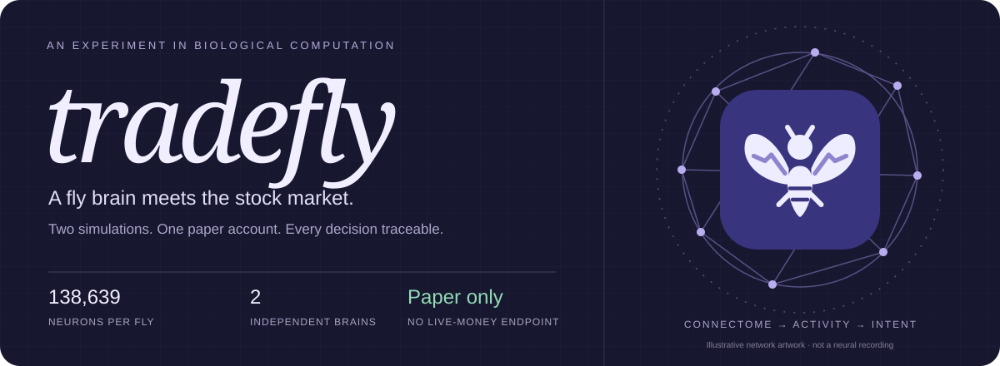
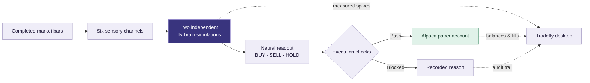
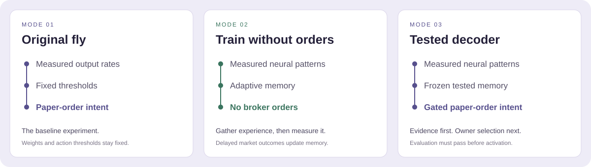
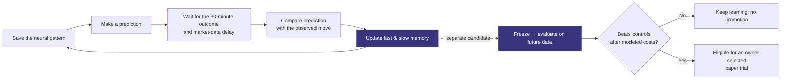
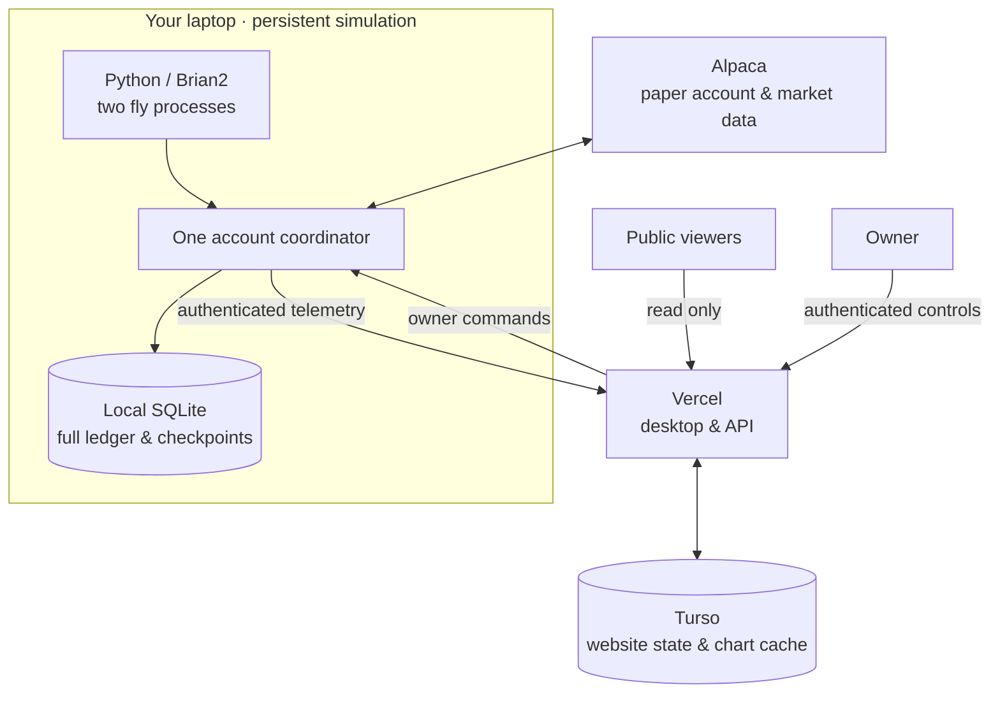

<p align="center">
  
</p>

<p align="center">
  <a href="https://papertradefly.vercel.app/">Open the desktop</a> ·
  <a href="docs/GETTING_STARTED.md">Run it yourself</a> ·
  <a href="docs/README.md">Explore the docs</a> ·
  <a href="docs/BRAIN.md">Inside the brain</a>
</p>

# What if a fly had a trading desk?

**Tradefly turns measured activity from simulated fruit-fly brains into paper-trading decisions.** Two independent simulations explore available stocks, a coordinator handles the paper account, and a windowed desktop lets you inspect what happened—from market input to neuron activity to broker outcome.

It is part neuroscience experiment, part trading lab, and part tiny fly sitting at a very serious computer.

> **The honest version:** the fly connectome supplies neural activity; humans designed the market inputs, action mapping and execution rules. A separate, fly-inspired memory layer can learn from later market outcomes. This is not a biological fly that understands finance, and profitability has not been established.

## A desktop for watching the experiment

| Open this | See this |
| :--- | :--- |
| **Observation desk** | Account history, holdings, interactive price charts, and the latest decisions. |
| **Brain activity** | Recorded spikes mapped to the brain visualization, with sampling and source information. |
| **Training Lab** | Delayed feedback, memory updates, held-out comparisons, and the checks required before a learned decoder can trade. |
| **Evidence desk** | The chain from market observation → neural response → intent → execution → fill. |
| **Fly log & trade ledger** | Factual activity, sortable holdings, broker outcomes, and exports. |
| **Fly habitat** | A 3D fly at a trading screen displaying account telemetry. The typing is decorative. |

Drag windows, snap them to halves or quarters, arrange the desktop, and hover over charts to inspect the underlying readings. Public visitors can watch; only the owner can change controls.

## How a market observation becomes a decision



Each fly simulates **138,639 neurons** from the FlyWire female v783 dataset. The connectivity contains **15,091,983 neuron-pair rows representing 54,492,922 synapses**. Tradefly adapts the Shiu/Spiller Brian2 reference model; the input mapping and trading labels are our experiment design.

By default, the coordinator visits Alpaca's active, tradable US-equity universe—including ETFs—in a stable, price-independent order. The optional [Jev news scout](docs/TYPESAFE.md) alternates relevant news priorities with that regular tour; the flies retain every trade decision. Available data and simulation throughput determine which stocks get evaluated. **All stocks are eligible; not every stock has usable current input data.** Five minutes is the input-bar resolution, not a five-minute pause between stocks.

[Model, exact populations & adaptations →](docs/BRAIN.md) · [Two-fly scheduling →](docs/PARALLEL_FLIES.md)

## Three modes, one clear boundary



| Mode | What changes with experience? | Can submit paper orders? |
| :--- | :--- | :--- |
| **Original fly** | Neural state evolves; connectome weights and original decoder stay fixed. | Yes, after owner Resume and execution checks. |
| **Train without orders** | A separate associative memory learns from delayed outcomes. | **No.** Existing holdings remain open. |
| **Tested decoder** | The selected execution memory stays frozen; shadow learning continues separately. | Only after evaluation passes, owner selection, and Resume. |

All modes start paused. Account reconciliation, corporate-action verification and other readiness checks still apply to training-only operation.

### What “learning” means here



The learning rule is inspired by reward-modulated associative memory. **The underlying connectome remains fixed.** The memory receives measured neural features, not a separate price-based trading signal. Evaluation compares the learned readout with the original fly, cash, always-buy, momentum, and a version with neural input removed.

These are independent hypothetical opportunities—not portfolio returns. The gate includes held-out coverage and modeled trading costs; passing it permits a paper trial, not a profitability claim.

[Learning method, evaluation gates & limitations →](docs/LEARNING-LAB.md)

## Where everything runs



**Vercel hosts the interface. Your laptop runs the brains.** Closing the website does not stop the worker; sleeping or stopping the laptop prevents fresh simulations and telemetry. Alpaca credentials stay local.

## Get started

**Just looking?** [Open the public desktop](https://papertradefly.vercel.app/). No broker credentials are needed to watch the owner's run. The synthetic Demo is a separate, clearly labeled mode.

**Running your own checkout?** Use Node 22.18+ and Python 3.12 with `uv`. Start with the [complete setup guide](docs/GETTING_STARTED.md), which covers the database, owner login, paper credentials, pinned brain data, validation and worker connection.

For an **already configured checkout**:

```sh
# Desktop — terminal 1
npm run dev:vercel

# Two fly simulations, chart helper and learning service — terminal 2
npm run backend
```

The worker starts paused. Sign in as owner, inspect readiness, choose a mode, then Resume. Keep the worker's configured website URL pointed at the desktop you intend to control.

[First-time setup →](docs/GETTING_STARTED.md) · [Deploy on Vercel →](docs/VERCEL.md) · [Daily operation →](docs/USER_SETUP.md)

## Read the numbers correctly

| Data | Meaning |
| :--- | :--- |
| **Trading inputs** | Completed regular-session IEX bars; coverage can be sparse. |
| **Price charts & learning outcomes** | Historical SIP data requested at least 16 minutes behind the clock. This does not upgrade the trading feed. |
| **Account change** | Broker equity minus the experiment baseline; it can include manual activity or accounting errors. |
| **All time** | The full recorded account timespan, condensed for plotting with extrema retained. The full ledger stays local. |
| **Unverified performance** | A corporate action or unavailable check prevents the balance from being treated as reliable performance. Affected readings are withheld. |
| **Demo / Swarm research** | Separate research or synthetic views; they cannot place Alpaca orders. |

Default execution is long-only and cash-sized: **$100 maximum intended order**, **10% total portfolio entry exposure**, one account coordinator, and no live-money endpoint. Market fills can differ from the sizing price. Pause stops new submissions and requests cancellation of Tradefly's open orders; it does not liquidate holdings.

Corporate-action evidence persists across restarts and feed failures. The app does not manufacture corrected balances or quietly erase suspicious gains. [How the checks work →](docs/CORPORATE-ACTIONS.md)

## Documentation map

| I want to… | Go here |
| :--- | :--- |
| Install and connect everything | [Getting started](docs/GETTING_STARTED.md) |
| Understand what I am watching | [Desktop guide](docs/DESKTOP.md) |
| Inspect the neuroscience | [Brain implementation](docs/BRAIN.md) · [Sources](docs/SOURCES.md) |
| Understand the learning layer | [Training Lab](docs/LEARNING-LAB.md) |
| Operate or recover the worker | [Backend](docs/BACKEND.md) · [Position recovery](docs/POSITION-RECOVERY.md) |
| Check what has actually been tested | [Validation record](docs/VALIDATION.md) |
| See what is built and what comes next | [Roadmap](docs/ROADMAP.md) |
| Browse everything | [Documentation index](docs/README.md) |

## Development

```sh
npm test                 # Desktop logic, accounting and chart semantics
uv run pytest -q         # Backend, execution, learning and reconciliation
npm run build:vercel     # Production web build
npm run test:vercel      # Isolated production API/auth checks
```

The production API checks use a temporary database and throwaway keys; they do not call Alpaca. Downloaded brain data, credentials, checkpoints and run output are ignored by Git.

```text
app/                 Desktop entry points and authenticated API routes
components/          Windows, charts, evidence views and the fly habitat
lib/                 UI data models, research tools and server adapters
backend/tradefly/    Simulation, paper execution, learning and audit services
scripts/             Setup, validation, replay and deployment helpers
docs/                Operating guides, research notes and provenance
```

## Built on the work of others

- **[Shiu et al. / Spiller reference model](https://github.com/philshiu/Drosophila_brain_model)** — connectome-based simulation; pinned revision and adaptations documented in [BRAIN.md](docs/BRAIN.md).
- **[FlyWire](https://flywire.ai/)** — adult female brain connectivity. This is not the newer male CNS dataset.
- **[FlySwarm](https://github.com/semkazz1/FlySwarm)** — inspiration and adapted components for the separate Swarm research desk; see the [feature and license audit](docs/FLYSWARM_AUDIT.md).
- **Brian2, Three.js, Next.js, Alpaca and Turso** — simulation, visualization, desktop and data infrastructure.

Upstream notices are retained in [`licenses/`](licenses/), [`lib/swarm/LICENSE`](lib/swarm/LICENSE), and the public asset notices. Upstream code licenses do not license the brain datasets or the entire Tradefly repository; there is currently no repository-wide license grant. [Asset provenance →](docs/ASSETS.md)

<p align="center"><sub>A small fly. A large experiment. Check the evidence.</sub></p>
