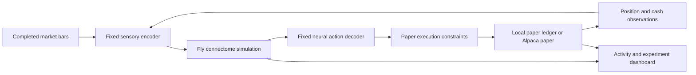

# tradefly

A paper-trading experiment in which a simulated fruit fly connectome is the sole source of directional trading decisions.

**Status: real paper backend implemented and connected; starts paused.** The desktop has separate Paper and Demo modes. The Paper mode receives the real Alpaca account, measured full-network neural decisions, order outcomes, and audit records from a local Python worker. See [backend setup and operation](docs/BACKEND.md), [brain implementation](docs/BRAIN.md), and [validation evidence](docs/VALIDATION.md).

Run the worker with `uv sync --python 3.12`, then `npm run backend`. Keep the Mac awake. Use Paper → Resume in the private desktop after readiness checks pass. No live-money endpoint exists.

## Run the desktop

Use Node 22.18+ (24+ recommended for the test runner). Run `npm ci`, then `npm run dev`. `npm test` checks decision thresholds, accounting, execution timing, and metrics. `npm run build` produces the hosted application. See [desktop architecture and data semantics](docs/DESKTOP.md).

The question: can a fixed biological network, given numerical market inputs through a transparent interface, produce interesting trading behavior?

“Only the brain” means the fly network supplies every buy/sell/hold intent. Human-designed encoding and decoding are necessary and are part of the experiment. They will be fixed, published, and audited; no market signal can bypass the network to choose an action. Execution constraints may reject or reduce an order but cannot invent or reverse a trade.

The first version uses fixed neural weights. It does not learn from profits, understand stocks, or establish a recreation of a living fly. We are testing behavior, not assuming a profitable strategy.

## Current defaults

- FlyWire female v783 data, with the Shiu et al. Brian2 model as the reference implementation. This is distinct from the newer male CNS dataset; using the male map is a later explicit migration.
- Every active, tradable US equity symbol returned by Alpaca (including ETFs). No handpicked shortlist. One shared brain continuously processes a neutral sensory tour; its measured output alone supplies each directional intent. Data gaps and unvisited stocks remain visible.
- Completed five-minute input bars during regular US sessions; several stocks can be evaluated per boundary. There is no five-minute sleep between symbols.
- Real account cash comes from Alpaca (initially $100,000); historical replay and Demo use separate $10,000 ledgers. Long-only, $100 maximum intended order and 10% total portfolio entry exposure; no borrowing or shorting.
- Historical replay and Alpaca paper-only integration are implemented. The worker starts paused.
- Local Python worker, SQLite event ledger and private hosted telemetry. Fly log provides factual chronological activity; Decision inspector shows the detailed neural evidence.

The real account balance comes from Alpaca rather than the demo bankroll. Execution enforces cash-only entry sizing and checks actual holdings; market fills may drift from the sizing reference price. The demo remains a separate synthetic ledger. See [the technical plan](docs/PLAN.md), [milestones](docs/ROADMAP.md), [user setup](docs/USER_SETUP.md), and [sources](docs/SOURCES.md).

## Files

| Path | Purpose |
| --- | --- |
| `docs/PLAN.md` | Architecture, neural interfaces, scientific controls, execution behavior |
| `docs/ROADMAP.md` | Build order and completion criteria |
| `docs/USER_SETUP.md` | Account setup and optional preferences |
| `docs/SOURCES.md` | Research and API references |
| `config/experiment.example.toml` | Original planning settings; runtime uses frozen Python/manifest parameters |
| `.env.example` | Local paper credential names |

Large datasets, credentials, downloaded third-party code, and experiment output stay outside Git. Any reused code must retain its upstream license, and data licenses and attribution must be recorded independently.
