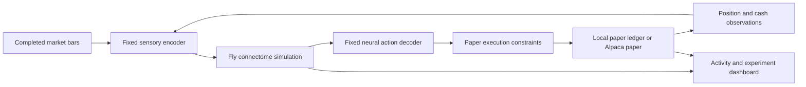

# tradefly

A paper-trading experiment driven by measured activity from two simulated fruit fly connectomes. Original mode uses a fixed neural decoder; the Training Lab adds an engineered, fly-inspired reward-learning readout. This is not a claim of biological financial intelligence or proven profitability.

**Status: real paper backend implemented and connected; starts paused.** The desktop has separate Paper and Demo modes. The Paper mode receives the real Alpaca account, measured full-network neural decisions, order outcomes, and audit records from a local Python worker. See [backend setup and operation](docs/BACKEND.md), [brain implementation](docs/BRAIN.md), and [validation evidence](docs/VALIDATION.md).

Run the worker with `uv sync --python 3.12`, then `npm run backend`. The default is two independent flies; see [parallel operation and benchmark](docs/PARALLEL_FLIES.md). Keep the Mac awake. Use Paper → Resume in the private desktop after readiness checks pass. No live-money endpoint exists.

## Training Lab

Open **Training Lab** on the desktop for held-out comparison graphs, delayed rewards, memory updates and promotion checks. The learning service starts with the local worker and persists its dataset/memory under `runs/learning/`. It uses free delayed historical SIP data and never places exploration orders.

Select **Train without orders** while paused, then Resume to collect fresh neural observations without submitting new orders. Existing paper holdings remain in the account. Original paper trading and an eligible learned decoder can be selected separately while paused. [Implementation plan, biology, evaluation limits and operating modes](docs/LEARNING-LAB.md).

For a read-only standalone catch-up: `.venv/bin/python -m tradefly.learning_lab --once --max-fetches 300`. A single-writer lock prevents overlap with the runner's learning service. No paid service or extra brain process is needed.

## Run the desktop

**Vercel deployment is supported.** See [the Vercel setup guide](docs/VERCEL.md) for the free Turso database, private owner login, environment variables and local worker connection. The checked-in `vercel.json` selects the Next.js build; existing Sites build commands still work.

Use Node 22.18+ (24+ recommended for the test runner). Run `npm ci`, then `npm run dev`. `npm test` checks decision thresholds, accounting, execution timing, and metrics. `npm run build` produces the hosted application. See [desktop architecture and data semantics](docs/DESKTOP.md).

The question: can a fixed biological network, given numerical market inputs through a transparent interface, produce interesting trading behavior?

“Only the brain” means the fly network supplies every buy/sell/hold intent. Human-designed encoding and decoding are necessary and are part of the experiment. They will be fixed, published, and audited; no market signal can bypass the network to choose an action. Execution constraints may reject or reduce an order but cannot invent or reverse a trade.

The first version uses fixed neural weights. It does not learn from profits, understand stocks, or establish a recreation of a living fly. We are testing behavior, not assuming a profitable strategy.

## Current defaults

- FlyWire female v783 data, with the Shiu et al. Brian2 model as the reference implementation. This is distinct from the newer male CNS dataset; using the male map is a later explicit migration.
- Every active, tradable US equity symbol returned by Alpaca (including ETFs). No handpicked shortlist. Two independent fly brains process different stocks in the same neutral sensory tour. Each measured neural output supplies its own directional intent; one coordinator serializes orders for the shared paper account. Data gaps and unvisited stocks remain visible.
- Completed five-minute input bars during regular US sessions; several stocks can be evaluated per boundary. There is no five-minute sleep between symbols.
- Real account cash comes from Alpaca (initially $100,000); historical replay and Demo use separate $10,000 ledgers. Long-only, $100 maximum intended order and 10% total portfolio entry exposure; no borrowing or shorting.
- Historical replay and Alpaca paper-only integration are implemented. The worker starts paused.
- Local Python worker, SQLite event ledger and private hosted telemetry. Fly log provides factual chronological activity; Decision inspector shows the detailed neural evidence.

The real account balance comes from Alpaca rather than the demo bankroll. Execution enforces cash-only entry sizing and checks actual holdings; market fills may drift from the sizing reference price. The demo remains a separate synthetic ledger. See [the technical plan](docs/PLAN.md), [milestones](docs/ROADMAP.md), [user setup](docs/USER_SETUP.md), and [sources](docs/SOURCES.md).

## Files

| Path | Purpose |
| --- | --- |
| `docs/PLAN.md` | Architecture, neural interfaces, scientific controls, execution behavior |
| `docs/ROADMAP.md` | Build order and completion criteria |
| `docs/USER_SETUP.md` | Account setup and optional preferences |
| `docs/SOURCES.md` | Research and API references |
| `config/experiment.example.toml` | Original planning settings; runtime uses frozen Python/manifest parameters |
| `.env.example` | Local paper credential names |

Large datasets, credentials, downloaded third-party code, and experiment output stay outside Git. Any reused code must retain its upstream license, and data licenses and attribution must be recorded independently.

## Swarm research desk

The separate Swarm research window adapts FlySwarm's token radar, holder sample, funding graph, wallet dossiers, cohort memory, explainable rule scores, simulated position plans and terminal. Token/holder observations are labeled by source; funding/cohort/return examples are prominently synthetic. Research settings cannot place Alpaca orders or alter the biological simulation. See [the upstream audit and feature map](docs/FLYSWARM_AUDIT.md).

### Fly habitat

Open **Fly habitat** from the desktop to see a 3D activity avatar at its trading desk. Drag to orbit and scroll/pinch to zoom. It follows paper-worker telemetry, distinguishes order intents from broker-confirmed fills, and shows the latest measured BUY/SELL firing rates. Preview buttons animate sample states without placing orders or resuming trading. Motion can be paused and respects reduced-motion preferences. The stylized movements are illustrative, not biological motor outputs. Three.js license: `public/three-license.txt`.

### Evidence desk

Paper stock charts load seven days of completed, regular-session SIP candles independently of the decision log. SIP covers US exchanges and is requested at least 16 minutes behind the current clock to stay within Alpaca's free historical entitlement. The UI labels the delay; missing intervals remain empty. Search any symbol or select a holding. The private chart cache refreshes at most every five minutes per viewed symbol. Broker credentials remain on the Mac.

The read-only chart helper starts automatically with `npm run backend`; it can also run alongside an existing worker with `uv run python -m tradefly.chart_history`. Keep the Mac awake for fresh charts. This helper never submits orders, alters neural state, or changes the trading feed: flies continue using completed IEX bars with their existing freshness checks. No paid data subscription is required.

The read-only Evidence desk links decisions from Observation desk, Decision inspector, Trade ledger and Fly log into market input → neural response → intent → execution → broker outcome. Stock dossiers and the paginated market map distinguish visited stocks, missing inputs and unseen symbols. Views use the bounded telemetry snapshot and label missing/older records explicitly; full history remains in the local ledger.

Replay comparison re-executes the recorded single-stock intraday pilot under its original next-open fill/cost convention and verifies the reported P&L before displaying cash, one $100 buy-and-hold entry and 30 seeded random-action controls. It does not rerun neural seeds or establish held-out profitability. All control paths and assumptions can be exported.

## Corporate-action checks

The worker checks corporate actions before trusting performance or submitting new orders. Affected balances are labeled unverified, profit readings are withheld, and contaminated learning observations are excluded. See [the reconciliation policy](docs/CORPORATE-ACTIONS.md). Raw broker history and fills remain intact.
