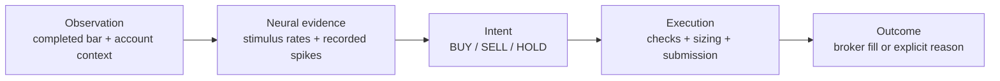

# A guide to the desktop

[← Documentation](README.md) · [Open Tradefly](https://papertradefly.vercel.app/) · [Read the experiment](WATCHING_TRADEFLY.md)

Tradefly is a browser desktop. Its windows are different views of the same experiment; opening or rearranging them does not change the brain or place an order.

## Find your window

| Window | The question it answers |
| :--- | :--- |
| Observation desk | What is the account doing right now? |
| Brain activity | Which recorded neurons fired in this observed step? |
| Training Lab | Is memory changing, and does the tested decoder beat its comparisons? |
| Decision inspector | Which inputs, neural rates and decoder produced this intent? |
| Evidence desk | Did that intent become an order, a fill or a blocked action? |
| Trade ledger | What was submitted, what filled, and what is held? |
| Performance lab | How do recorded account outcomes and research comparisons differ? |
| Fly log | What happened, in chronological order? |
| Fly habitat | Can I watch a small fly sit at a trading terminal? Yes. |
| Data & definitions | What do the sources, settings and metrics mean? |
| Swarm research | What do the separate token, wallet and cohort research tools show? |

## Read a decision from left to right

An intent is not a fill. A blocked BUY remains a BUY intent with a recorded execution veto. The Fly log describes evidence; it does not generate a fly's inner monologue or use an LLM to invent reasoning.

## Arrange the workspace

- Drag title bars to move windows; drag to an edge or corner for half- or quarter-screen snapping.
- Resize, minimize, maximize and restore windows from the taskbar.
- Move desktop icons freely during a session. Refresh restores their default positions.
- On smaller screens, windows use the available workspace rather than overflowing below the taskbar.

## Explore the charts

Hover, tap, or focus a chart and use the arrow keys to inspect its values. The account-range controls affect the account history and drawdown views. **All time** covers the full recorded account timespan; older samples are condensed while preserving extrema. Displayed date bounds make the selected span explicit. Full records remain in the local ledger.

Stock charts have a separate selector for recent bars or the past seven days. They use delayed SIP candles, independently of the fly's IEX input feed. Gaps stay visible; missing data is not a flat price or a HOLD decision.

Holdings become internally scrollable after ten rows. Search, numeric sorting, profit/loss filters and known-fill timestamps help explore them. A latest fill is the latest known fill in the received snapshot, not a guaranteed position-opening timestamp.

## Know which world you are in

| Label | What it means |
| :--- | :--- |
| Paper | A local worker's Alpaca paper account and recorded neural decisions. |
| Demo | A deterministic synthetic session for exploring the interface. |
| Historical replay | Recorded market data with explicitly simulated execution assumptions. |
| Training Lab | Independent hypothetical outcomes used to evaluate a learned readout. |
| Unverified | The account or corporate-action evidence does not support reliable performance reporting. |
| Offline / saved readings | The desktop has not received fresh telemetry. |

The app does not silently replace disconnected paper telemetry with demo data. Corporate-action warnings withhold affected gains and graph segments, including on the 3D monitor. Raw broker records remain auditable.

## Public observation, private controls

On Vercel, public visitors can read the published experiment. Owner login is required for pause/resume, decoder changes and other mutations. Broker credentials never enter the browser. The simulation continues independently of open windows and browser tabs.

Pausing the fly avatar's motion only pauses the decorative animation. Use the paper-account Pause control to stop new submissions; it does not liquidate holdings.

## Visual and data provenance

The interface uses the project's indigo photographic wallpaper, restrained window chrome, and green/red financial charts. Wallpaper provenance is in [ASSETS.md](ASSETS.md). Brain geometry and sampled recorded spikes are explained in [brain visualization research](BRAIN_VISUALIZATION_RESEARCH.md). The avatar's typing is illustrative, not the simulation's biological motor output.
