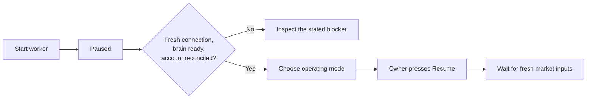

# Getting started

[← Documentation](README.md) · [Deployment guide](VERCEL.md) · [Backend reference](BACKEND.md)

Tradefly has two parts: a web desktop and a persistent local simulation. You can explore the [public desktop](https://papertradefly.vercel.app/) without running either yourself. That site displays its owner's experiment; it is not a hosted service where visitors enter broker keys.

## Choose your path

| Goal | What you need |
| :--- | :--- |
| Watch the existing experiment | A browser. Controls remain owner-only. |
| Develop the desktop | Repository access, Node 22.18+, and the web settings below. |
| Run your own paper experiment | The desktop setup plus Python 3.12, `uv`, Git, a dedicated Alpaca paper account, and validated brain data. |

The full simulation is substantial. Leave memory and disk headroom; checkpoint files are about 250 MB per fly and are replaced atomically. The current installation uses two fly processes. Read the [measured hardware and throughput notes](PARALLEL_FLIES.md) before choosing a host. A browser tab or Vercel function cannot run these persistent simulations.

Brian2 compiles the simulation with Cython, so the simulation host also needs a working C/C++ compiler. On macOS, install Apple's Command Line Tools with `xcode-select --install` if they are not already available.

## 1. Get the project and install dependencies

From a new working directory, using an account with repository access:

```sh
git clone https://github.com/DocMorphic/tradefly.git
cd tradefly
npm ci
uv sync --python 3.12
```

## 2. Configure the desktop

```sh
npm run setup:vercel
```

This creates an ignored `.env.local` with distinct owner and bridge keys. It does not print them or overwrite an existing file. Add your Turso libSQL URL and auth token, then migrate the **website database**:

```sh
npm run db:migrate
npm run dev:vercel
```

Open the local URL printed by Next.js. For a hosted desktop, follow [Vercel deployment](VERCEL.md). Alpaca keys belong on the simulation host, not in Vercel or browser-prefixed variables.

| Local file | Contents | Used by |
| :--- | :--- | :--- |
| `.env` | `ALPACA_PAPER_API_KEY`, `ALPACA_PAPER_SECRET_KEY` | Local paper broker adapter |
| `.env.local` | Turso URL/token, `TRADEFLY_OWNER_KEY`, `TRADEFLY_BRIDGE_TOKEN` | Local Next.js desktop; corresponding server settings go to Vercel |
| `.env.bridge` | Desktop origin and matching `TRADEFLY_BRIDGE_TOKEN` | Local worker → desktop connection |

These files are ignored. [`.env.example`](../.env.example) lists the variable names. The owner key signs you into the desktop; the bridge key authenticates the worker. They are different credentials.

## 3. Add paper credentials and connect the worker

For a fresh installation with no `.env`:

```sh
uv run python scripts/configure-alpaca.py
```

Enter keys from Alpaca's **paper** dashboard when prompted. Input is hidden. Existing `.env` files are left untouched.

Create `.env.bridge` locally, using the desktop's actual origin and the same bridge key as its server settings:

```dotenv
# Example local desktop; use its printed port.
TRADEFLY_SITE_URL=http://127.0.0.1:3000
TRADEFLY_BRIDGE_TOKEN=YOUR_DESKTOP_BRIDGE_KEY
```

For a hosted desktop, use its canonical `https://…vercel.app` origin with no path. The local HTTP exception permits only `localhost` and `127.0.0.1`. Vercel protection bypass is optional and separate from Tradefly authentication. Sites tokens are relevant only to the legacy Sites deployment. See [the deployment guide](VERCEL.md).

Read-only broker check:

```sh
uv run python -m tradefly.runner --once
```

This does not load a brain or submit orders. A connected account does not, on its own, mean neural validation has passed.

## 4. Prepare the pinned brain and validate it

On a fresh checkout, download the research reference into the ignored vendor directory and select the exact revision used by this experiment:

```sh
git clone https://github.com/philshiu/Drosophila_brain_model.git vendor/fly-reference
git -C vendor/fly-reference checkout 91bdd1e7dcf193f3e7ca5a8933497fcef63b7960
uv run python scripts/prepare-brain.py
uv run python scripts/benchmark-brain.py
uv run python scripts/check-brain-checkpoint.py
uv run python scripts/check-brain-restart.py
uv run python scripts/check-neural-activity.py
```

If the vendor checkout already exists, inspect it before changing it; do not overwrite an existing experiment's data or checkpoints. Review [model provenance and adaptations](BRAIN.md). The preparation script rejects an unpinned reference revision. Validation reports are written under ignored `data/brain/`; the response check must report `passed: true`, and checkpoint checks must succeed. Do not edit a report to force readiness.

Run full-network checks sequentially, with the trading worker stopped. They load substantial neural state and are not the lightweight unit-test suite.

## 5. Start paused, inspect, then choose a mode

```sh
npm run backend
```

The default is two fly processes plus the chart and learning helpers. The worker restores trusted local checkpoints where available and starts paused. Do not launch a second coordinator against the same ledger.



Sign in with your owner key. Select Original, Train without orders, or an eligible tested decoder while paused. Training-only mode blocks new broker submissions, but still requires valid account inputs and other readiness checks. Resume is a separate action. Existing holdings remain open when paused or training.

Keep the laptop awake and the worker running. With no fresh usable regular-session inputs, there will be no new neural decisions. See [what to watch](WATCHING_TRADEFLY.md).

## Common first-run questions

| Symptom | Check |
| :--- | :--- |
| Desktop says offline | Worker process, laptop sleep, desktop origin and matching bridge key. |
| Resume is blocked | Read the exact readiness reason. Do not clear recovery markers or fabricate balances. |
| A corporate-action warning appears | Performance is unverified; inspect [corporate-action reconciliation](CORPORATE-ACTIONS.md). |
| Most symbols have no data | The trading feed is IEX. Broad universe membership does not guarantee current bars. |
| Charts show delayed prices | Chart and learning history use delayed SIP independently of trading inputs. |
| Learned mode is unavailable | The candidate has not passed its current evaluation, or account verification is blocked. |
| Reloading does not stop the fly | The simulation is a separate local process. Use owner Pause to stop new orders. |

For normal shutdown, Pause and wait for acknowledgement, then stop the worker with Ctrl+C. Preserve `runs/`, `data/` and the account binding. [Recovery and exports →](BACKEND.md#recovery-and-exports)
