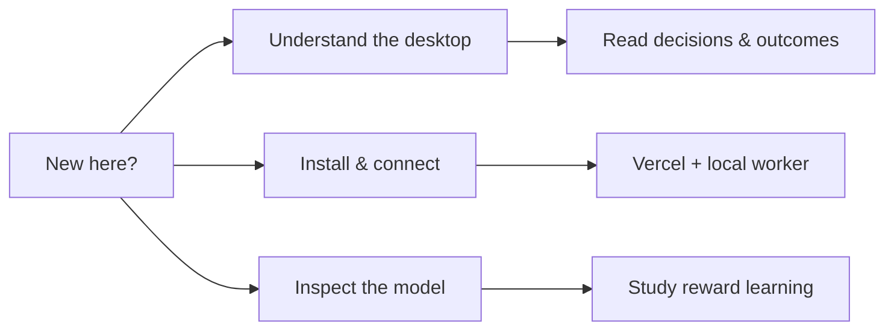

# The Tradefly field guide

[← Project overview](../README.md) · [Open the desktop](https://papertradefly.vercel.app/)

**Choose the question you came here to answer.** Operating guides describe the current implementation; dated experiment records describe what was tested at that time.

## Start here

| Question | Guide |
| :--- | :--- |
| What is Tradefly? | [Project overview](../README.md) |
| How do I run a fresh checkout? | [Getting started](GETTING_STARTED.md) |
| What should I look at while it runs? | [Watching Tradefly](WATCHING_TRADEFLY.md) |
| Which window does what? | [Desktop guide](DESKTOP.md) |
| How do I use an existing installation? | [Daily operation](USER_SETUP.md) |

## Run and maintain it

| Guide | Covers |
| :--- | :--- |
| [Vercel deployment](VERCEL.md) | Turso, server settings, owner login and the local bridge. |
| [Backend operation](BACKEND.md) | Scheduling, execution, state, exports and recovery. |
| [Two independent flies](PARALLEL_FLIES.md) | Separate neural states, one coordinator and measured throughput. |
| [Jev news scout](TYPESAFE.md) | Optional news priorities, local key setup, trial limits and selection audit. |
| [Corporate-action checks](CORPORATE-ACTIONS.md) | Split mismatches, unverified performance and execution gates. |
| [Position recovery](POSITION-RECOVERY.md) | Audited quarantine without fabricating fills or balances. |

## Inspect the experiment

| Guide | Covers |
| :--- | :--- |
| [Brain implementation](BRAIN.md) | Dataset counts, neuron IDs, stimulus mapping and reference-model adaptations. |
| [Training Lab](LEARNING-LAB.md) | Associative memory, causal labels, frozen evaluation and promotion gates. |
| [Validation record](VALIDATION.md) | Dated engineering checks and the limits of the evidence. |
| [Brain visualization research](BRAIN_VISUALIZATION_RESEARCH.md) | Geometry, spike display and visualization provenance. |
| [Research sources](SOURCES.md) | Primary scientific work and broker documentation. |
| [FlySwarm audit](FLYSWARM_AUDIT.md) | What was adapted, what stayed separate and upstream attribution. |
| [Assets](ASSETS.md) | Wallpaper, documentation artwork and provenance. |

## Design history and next steps

- [Roadmap](ROADMAP.md) — implemented capabilities and open research.
- [Original technical plan](PLAN.md) — the September 14 design proposal. It intentionally preserves the original fixed-weight, single-brain scope; it is not the current operations manual.
- [September 14 pre-resume check](PRE_RESUME_CHECK.md) — a historical validation record, not the current broker state.

> **Reading a result:** distinguish a synthetic demonstration, a historical replay, a held-out signal evaluation and an actual broker paper fill. They answer different questions. None, by itself, establishes a profitable strategy.
