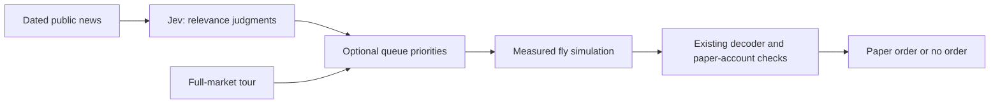

# TypeSafe / Jev integration assessment

[← Documentation](README.md)

Status on September 20, 2026: the TypeSafe skill is installed for Codex in this repository. No Jev API calls or trading-path integration are enabled. The owner is choosing between optional stock prioritization and an analysis-only companion. The free-only requirement remains in effect.

## What Jev can accelerate

Jev evaluates text or structured state and returns typed judgments and probabilities. It is a separate remote model, not a Brian2 simulation runtime. Adding its API cannot directly accelerate the connectome's differential equations, spike propagation or checkpoint writes. Replacing a neural evaluation with Jev's BUY/SELL/HOLD prediction would change which model makes the decision.

The latest 300 recorded decisions inspected on September 20 had a median simulation time of approximately 2.54 seconds and a median calculation-plus-checkpoint time of 3.75 seconds. These are historical measurements, not a fresh benchmark or the full time from market input to an order. Read current timings without changing the running experiment:

```sh
.venv/bin/python scripts/profile-decision-latency.py --limit 300
```

Actual simulation throughput improvements need separate profiling of Brian2 execution, passive activity recording, checkpoint I/O, scheduling and data fetching, followed by identical-state/restart validation. Do not shorten the neural time window or skip required checkpoints and call that an equivalent speed improvement.

## Candidate integration: prioritize attention

With explicit owner selection, Jev could assess the relevance and urgency of supplied public news, then suggest which eligible symbols to examine sooner. Numerical filters, eligibility, freshness, accounting and order sizing remain ordinary code. This could reduce the wait to inspect a relevant event; it does not make each fly evaluation faster or establish profitability.

Proposed flow:



Implementation requirements, not currently implemented:

- Verify a free, permitted news source and coverage before building a live fetcher. Jev receives supplied evidence; it is not itself a news feed or market-data source.
- First run judgments in observation-only mode. Compare latency, relevance, stock coverage and selection against the existing tour before changing the queue.
- Batch independent questions; cache by evidence, question and pinned model version. Record the exact inputs, answers, token usage and timings.
- Preserve guaranteed tour slots so prioritization cannot permanently exclude quiet stocks. Isolated symbols such as NCT remain excluded by code.
- Never block a fly waiting for Jev. Missing credentials, stale evidence, timeout, malformed results or exhausted allowance fall back to the ordinary tour.
- Distinguish Jev's selection influence from the fly's measured trade decision in the UI. Jev probabilities are not profit probabilities or a transcript of the fly's thoughts.
- Do not send account balances, holdings, fills, owner secrets or broker credentials. Use only the approved public evidence needed for the question.

An analysis-only alternative would classify public events for display without changing symbol order, neural input, decoder or execution. It would add context rather than speed up trading.

## API and cost boundary

The current HTTP contract is `POST https://api.typesafe.ai/v1/systemone` with bearer authentication, `state`, `model` and a map of typed `questions`; responses include `answers`, actual `model` and token `usage`. The documented current pinned model is `jev-1.13.0`. Recheck live docs before implementation.

The model page currently lists $0.042 per million input tokens and free output tokens. That is metered service, not evidence this account has a free allowance. No local TypeSafe key or verified free-credit budget was available during this assessment. Keep calls disabled until the owner supplies the key locally and confirms how free credits and paid overages are controlled. A token counter alone cannot prove the provider will not bill the account.

## Skill installation

Installed using one method:

```sh
npx --yes skills add typesafe-ai/skills --skill typesafe-ai --agent codex --yes
```

The project-local skill is in `.agents/skills/typesafe-ai/SKILL.md`; `skills-lock.json` records its source and content hash. Future Codex work on TypeSafe should read the skill and the relevant live docs. Installing the skill does not install a model or activate API calls.

Sources: [TypeSafe introduction](https://docs.typesafe.ai/introduction), [API](https://docs.typesafe.ai/api), [models and pricing](https://docs.typesafe.ai/models), [building guide](https://docs.typesafe.ai/concepts/how-to-build-with-system-one), [reranking cookbook](https://docs.typesafe.ai/cookbooks/rerank_typesafe).
