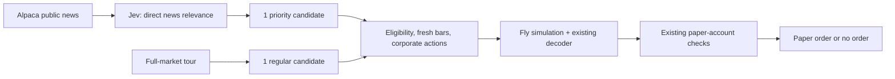

# Jev scouts the news. The flies decide.

[← Documentation](README.md)

Tradefly can use TypeSafe’s Jev to bring stocks with relevant public news forward in the queue. It runs beside the two fly simulations; it does not replace either brain or alter the neural decoder.



## Enable the local trial

The API key belongs on the machine running the Python worker, **not in Vercel or browser settings**. The local `.env.typesafe` file is ignored by Git. Create it if necessary:

```dotenv
TYPESAFE_API_KEY=your_key_here
TYPESAFE_ENABLED=1
TYPESAFE_MAX_CALLS=100
TYPESAFE_MAX_INPUT_TOKENS=1000000
```

Use `chmod 600 .env.typesafe`. The installed worker reloads this file each loop. Set `TYPESAFE_ENABLED=0` to turn the scout off; the normal tour continues. An already-sent request may finish. No worker restart is needed for a key/config change after installing this version.

Use your free credits and disable paid overages in the provider account if that control is available. The API is metered: these local limits **do not know your credit balance or guarantee zero provider charges**. Tradefly makes no subscription or purchase. The owner’s local setup starts disabled until they add their key and enable it.

The trial has hard ceilings of 100 requests and 1,000,000 budgeted input tokens; values may be lowered in the file. Usage persists across restarts in `runs/typesafe.sqlite3`. Before every request, Tradefly reserves a conservative input allowance based on request bytes and question count. Confirmed usage replaces that reservation; ambiguous failures retain it. There are no automatic retries of the same failed news batch. HTTP 401/402/403/429 stop further requests until configuration changes or the worker restarts; lifetime limits still apply. Do not delete the audit database to reset usage.

## What it actually does

1. While the flies are running and the market is open, a separate background thread checks up to 50 of Alpaca’s latest news articles every five minutes. The endpoint was accessible using the owner’s existing account on September 20, 2026. This is bounded recent coverage, not every headline on every stock.
2. Code keeps articles updated within the previous hour and tickers in the active, tradable US-equity universe. Each request contains at most eight article/ticker questions and 16 KB of JSON. Only the headline, short summary, ticker and public article identifiers/dates go to TypeSafe.
3. Pinned model `jev-1.13.0` answers one **Noul** question per article/ticker pair: does this report a substantive new event directly about the company? All independent questions share a single request. Jev is never asked for BUY, SELL, HOLD, price direction or expected returns.
4. Answers at or above 0.75 may enter the queue, sorted by relevance probability. This is an initial engineering threshold, **not a validated trading signal or profit probability**. Cached judgments expire after 15 minutes. Identical batches are not billed again; each article/ticker is consumed once per worker session.
5. A priority candidate alternates with a regular tour candidate. Priority picks do not advance the ordinary cursor. Already-visited stocks cannot stall the tour. Missing current IEX bars, corporate-action exclusions (including NCT) and all other existing checks still apply before neural evaluation.
6. The existing decoder receives the measured fly output. Jev scores never enter neural stimulus, learning features, sizing or order execution. Shadow mode remains training-only; adding Jev does not switch execution modes.

If the key, news, usable judgment or allowance is missing, the fly continues its ordinary tour. No fly waits for a Jev network request. Prioritization affects what the fly encounters and therefore can affect its subsequent state; it is disclosed as software-guided attention, not independent fly stock selection.

## See and audit the result

Open **Paper → Jev news scout** for status, remaining request allowance, reported/reserved input tokens, last successful API latency and the current priority queue. In the decision inspector, **Why this stock came forward** shows the source headline and relevance judgment for a priority pick. The complete record includes model, article ID, evidence date, scoring/expiry dates and selection policy.

The local SQLite audit stores the exact bounded public request, validated answers and usage, with a reservation saved before the API call. It never stores the TypeSafe authorization header. Public telemetry contains selected headlines and judgments but no TypeSafe or broker credentials, account identity, or full article content.

## What gets faster—and what does not

This can reduce the wait before a news-related stock is examined. It does not accelerate Brian2 or fix missing IEX bars. It does not establish profitability.

The latest 300 historical decisions inspected on September 20 had a median simulation time of **2.54 seconds** and calculation-plus-checkpoint time of **3.75 seconds**. These are not full market-to-order timings or a Jev benchmark. Inspect current local history without placing orders:

```sh
.venv/bin/python scripts/profile-decision-latency.py --limit 300
```

After a live trial, compare news-to-evaluation delay, ordinary-tour coverage, API latency/usage and paper results by selection source. Keep corporate-action-contaminated performance excluded. No speed or profitability improvement has yet been demonstrated with this integration.

## Development

The project-local TypeSafe skill is installed at `.agents/skills/typesafe-ai/SKILL.md`. Read it and the live docs for future changes. Installation used one method:

```sh
npx --yes skills add typesafe-ai/skills --skill typesafe-ai --agent codex --yes
```

Main code: `backend/tradefly/jev.py`, `market.py`, `parallel_market.py`. Tests use mocked TypeSafe responses and verify public-data boundaries, queue fairness, unchanged neural inputs, expiry, caching, failure handling and durable trial limits. They do not use credits or place broker orders.

Sources: [TypeSafe API](https://docs.typesafe.ai/api), [Noul](https://docs.typesafe.ai/primitives/noul), [models and pricing](https://docs.typesafe.ai/models), [reranking cookbook](https://docs.typesafe.ai/cookbooks/rerank_typesafe), [Alpaca news endpoint](https://docs.alpaca.markets/us/reference/news-3).
